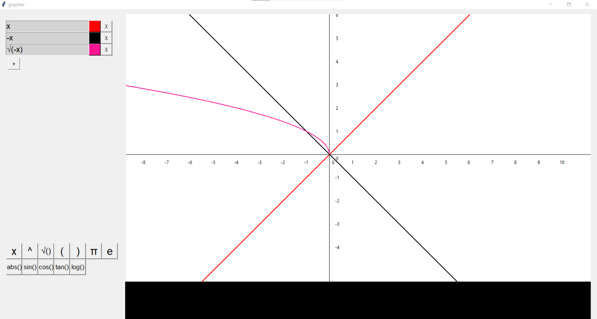
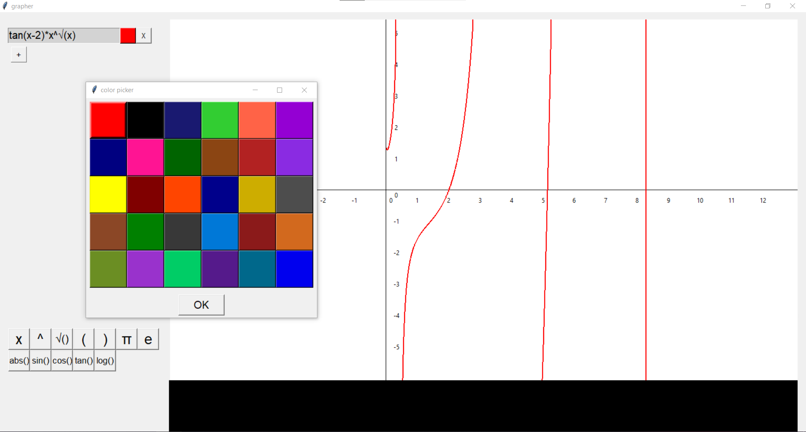
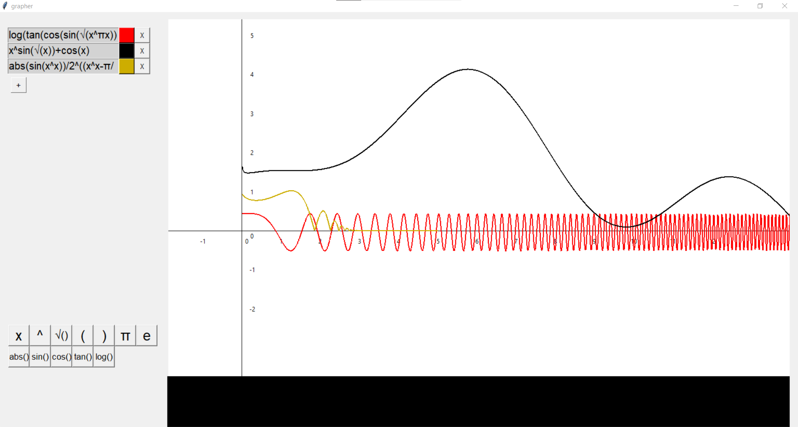

# Grapher

In high school I just learned some Python so I decided to create a graphing calculator. It is quite basic but it has all the needed functionalities. It really inefficiently uses graphics and so it is quite laggy with a high number of graphs (made in 2017)

## Requirements
 - Python 3
 - tkinter

## Credits
- [Tomáš Žilínek](https://www.linkedin.com/in/tomaszilinek)

